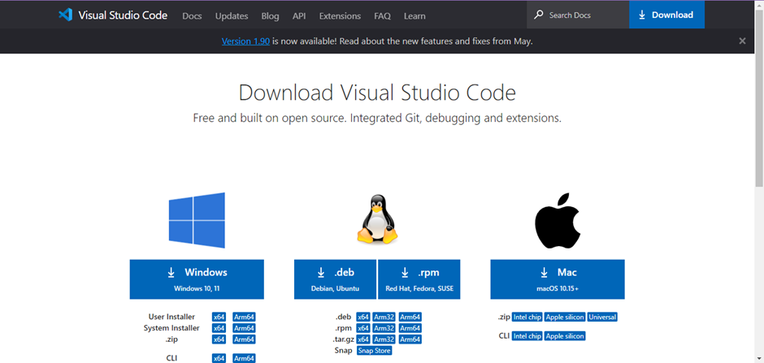
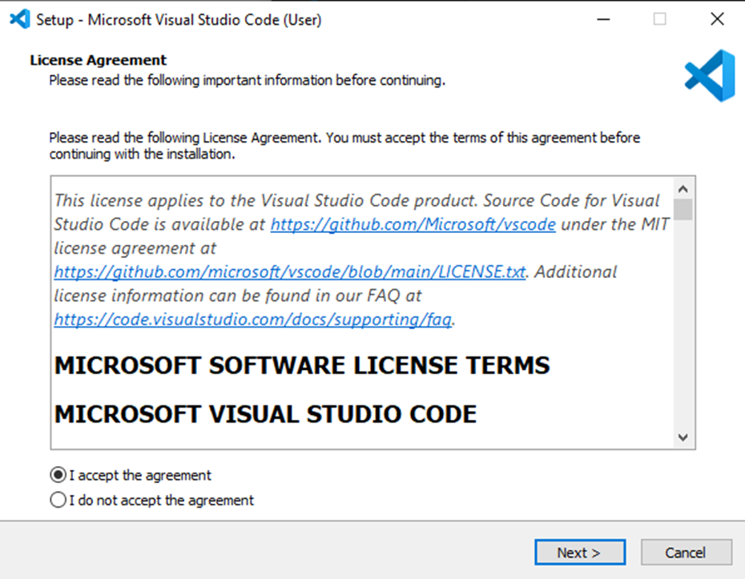
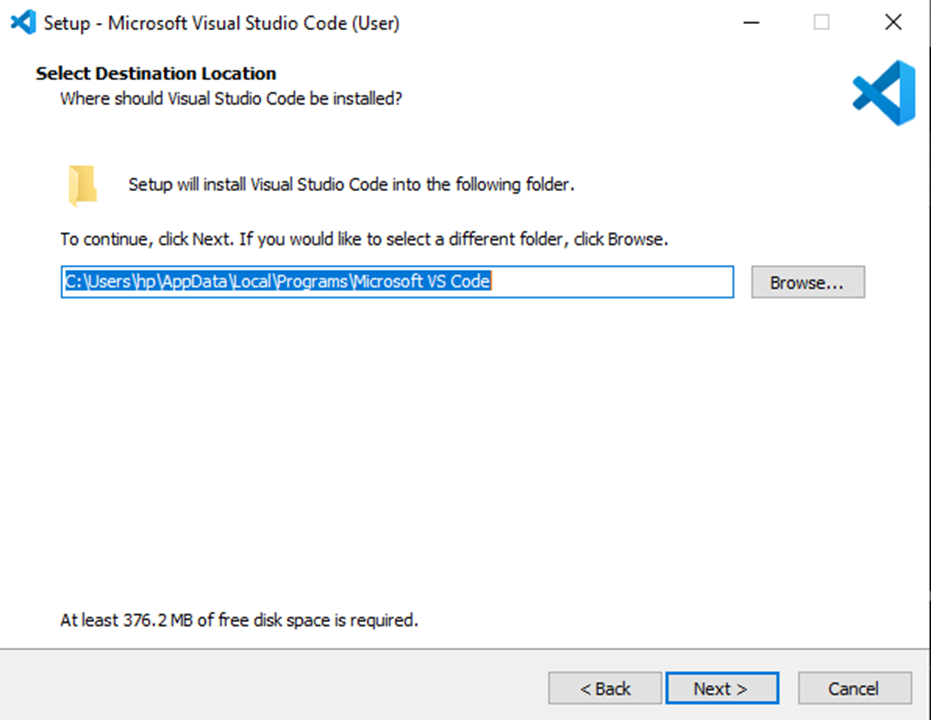
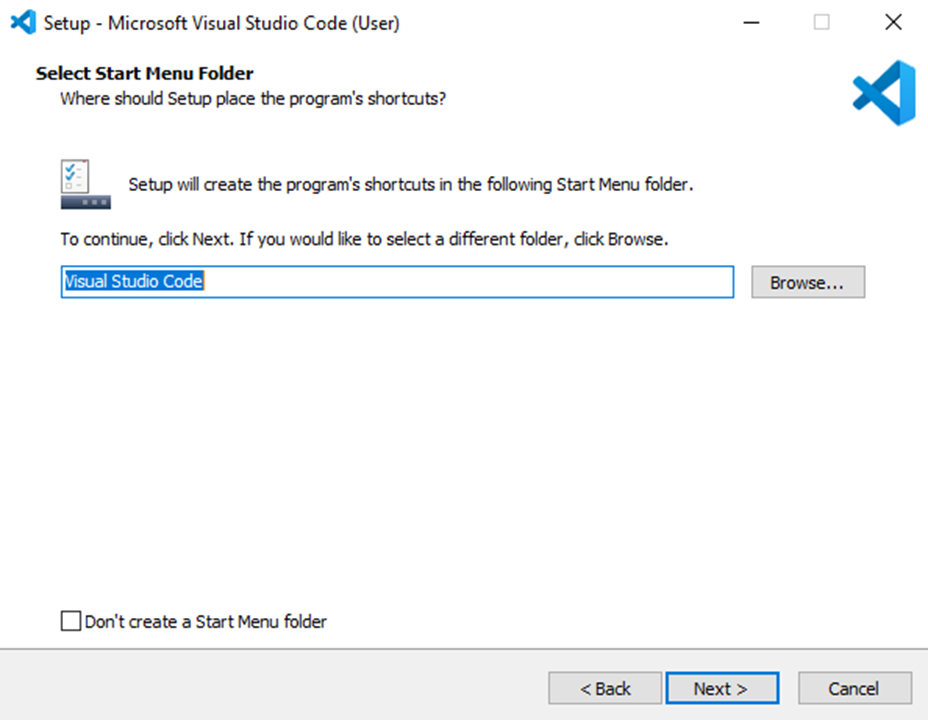
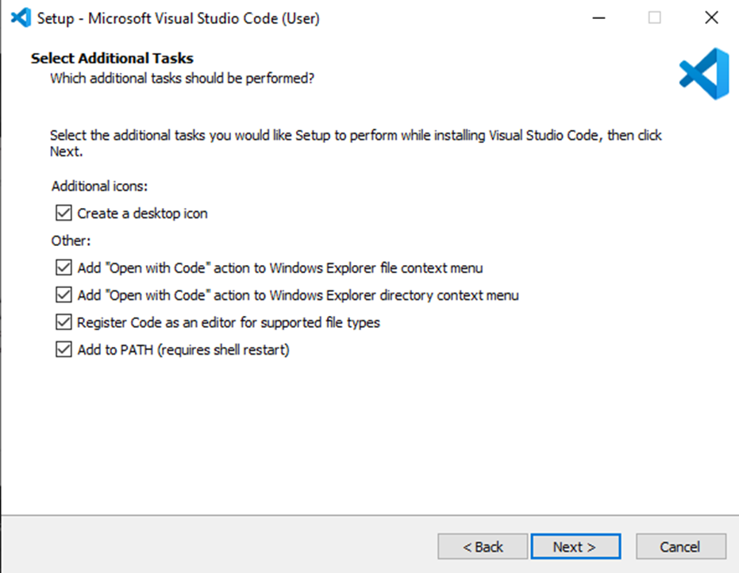
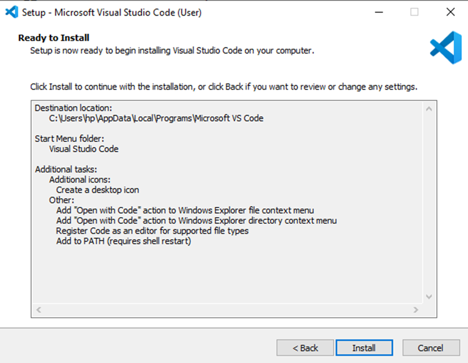
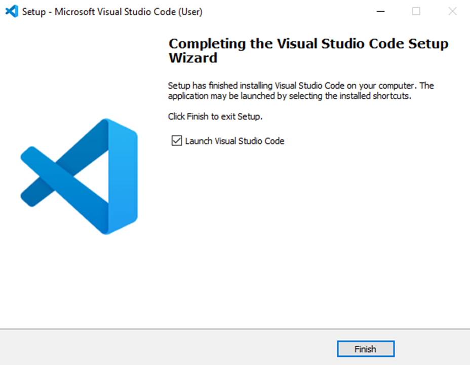

# SE-Assignment-5
Installation and Navigation of Visual Studio Code (VS Code)
 Instructions:
Answer the following questions based on your understanding of the installation and navigation of Visual Studio Code (VS Code). Provide detailed explanations and examples where appropriate.

 Questions:

1. Installation of VS Code:
   - Describe the steps to download and install Visual Studio Code on Windows 11 operating system. Include any prerequisites that might be needed.

Downloading and Installing Visual Studio Code
1. Download the Visual Studio Code Installer
•	Open your web browser and go to the official Visual Studio Code website: https://code.visualstudio.com/Download
•	On the homepage, you will see a download button that automatically detects your operating system. Click on the "Download for Windows" button. This will download the installer.

2. Run the Installer
•	Once the download is complete, locate the downloaded file (typically in your "Downloads" folder).
•	Double-click the file to run the installer.

3. Start the Installation Process
•	A User Account Control (UAC) prompt may appear, asking if you want to allow the app to make changes to your device. Click "Yes" to proceed.
•	The Visual Studio Code Setup Wizard will open then click "Next" to continue.

4. Accept the License Agreement
•	Read the License Agreement. If you agree to the terms, select the "I accept the agreement" option and click "Next".

5. Select Installation Location
•	Choose the destination folder where you want to install Visual Studio Code. 
•	If the default location is fine. Click "Next" to continue.

6. Select Start Menu Folder
•	Choose the Start Menu folder where you want to create the program's shortcuts. 
•	You can leave the default or specify a custom folder. Click "Next".

7. Select Additional Tasks
•	Create a desktop icon
Check this box if you want a desktop shortcut.

•	Add to PATH
Ensure the "Add to PATH" option is checked. This allows you to run VS Code from the command line.

•	Open with Code
Check both "Open with Code" options to add context menu entries for files and directories.

•	Register Code as an editor for supported file types
Check this box to use VS Code as the default editor for certain file types.

8. Install
Click "Install" to begin the installation.

9. Launch Visual Studio Code
After the installation is complete, check the "Launch Visual Studio Code" box and click "Finish".

2. First-time Setup:
   - After installing VS Code, what initial configurations and settings should be adjusted for an optimal coding environment? Mention any important settings or extensions.

Initial Configurations and settings
1.  Theme
Users can select a theme by navigating to File > Preferences > Color Theme to choose one that suits their preference. Popular choices include "Dark+ (default dark)" for its eye-friendly design during extended coding sessions.

2. Font Size
Adjusting the font size for better visibility is crucial. 
Settings for Editor: Font Size in the preferences menu (File > Preferences > Settings) allow customization. 

3. Auto Save
To prevent data loss, enabling auto-save (File > Auto Save > After Delay) ensures work is continuously saved without manual intervention.

4. Tab Settings
Maintaining consistent indentation enhances code readability. Users can set the tab size (Editor: Tab Size) to 3 spaces and enable Insert Spaces to replace tabs with spaces in the settings.

Key Extensions
1. Python
The Python extension by Microsoft offers comprehensive support for Python development, including IntelliSense and debugging capabilities.

2. Pylance
Pylance provides advanced language support and fast IntelliSense for Python development, enhancing coding efficiency.

3. Python Debugger
This extension facilitates debugging tasks, making it easier to identify and resolve issues within Python code.

4. Prettier - Code Formatter
Prettier automates code formatting to maintain consistent style across projects, enhancing code readability and developer productivity.

5. Code Runner
Code Runner allows for quick execution of code snippets directly within VS Code, ideal for testing and debugging purposes.

6. Live Server
Live Server launches a local development server with live reload capability, enabling real-time updates of web content during development.

7. Python Image Preview
This extension facilitates image preview directly within VS Code, useful for tasks involving image processing in Python.

8. GitLens
GitLens extends Git functionalities within VS Code, providing insights into code authorship, history, and repository metrics directly in the editor interface.

9. Docker
The Docker extension simplifies Docker container management and facilitates containerized application development, integrating seamlessly with Docker functionalities.

3. User Interface Overview:
   - Explain the main components of the VS Code user interface. Identify and describe the purpose of the Activity Bar, Side Bar, Editor Group, and Status Bar.

1. Activity Bar
The Activity Bar is located vertically on the far-left side of the VS Code window. It contains several icons that represent different views and functionalities. These include: 
•	Explorer (Folder icon)
Allows you to navigate through your project directory structure, view files, and manage files (create, delete, rename).
•	Search (Magnifying glass icon)
Provides tools for searching across files or within the current workspace.
•	Source Control (Git icon)
Integrates Git functionalities directly within VS Code, allowing you to manage source code repositories, view changes, commit, pull, and push changes.
•	Run and Debug (Play and bug icons)
Provides options to run and debug applications directly within VS Code, supporting various languages and frameworks.
•	Extensions (Puzzle piece icon)
Manages VS Code extensions, allowing you to install, enable, disable, and uninstall extensions to enhance functionality.
•	Remote Explorer (Globe icon)
Provides access to remote development environments, allowing you to connect to and work on remote servers or containers.

2. Side Bar
The Side Bar is located on the left-hand side of the editor area and contains different views and panels. They include: 
•	File Explorer
Displays the folder and file structure of your project. You can navigate directories, open files, and perform file management operations.
•	Search
Provides search functionality across files within your workspace.
•	Source Control
Integrates Git functionalities, showing Git status, changes, and history.
•	Extensions
Manages VS Code extensions, allowing you to browse and install new extensions.
•	Debug
Provides debugging tools and configurations for running and debugging applications.

3. Editor Group
The Editor Group refers to the central area of VS Code where you edit files. Each file you open in VS Code is represented as a tab within the Editor Group. Key features include:
•	Tabs
Each tab represents an open file. You can switch between tabs to edit different files.
•	Split Editors
You can split the editor vertically or horizontally to view and edit multiple files side by side.
•	Preview Mode
VS Code allows you to open files in preview mode, indicated by italicized tabs, which are automatically closed when you switch to another file or perform certain actions.

4. Status Bar
The Status Bar is located at the bottom of the VS Code window and provides various information and functionalities.Such as: 
•	Language Mode
Displays the current programming language mode of the active file.
•	Line and Column Numbers
Shows the current cursor position within the file (line number and column number).
•	Git Branch
If the file is part of a Git repository, it displays the current branch name and Git status (e.g., clean or number of modified files).
•	Notifications
Displays notifications such as extension recommendations, TypeScript version updates, and more.
•	Tasks
Allows you to run tasks defined in your workspace configuration or extensions.
•	Output Switcher
Provides quick access to different output views such as Terminal, Debug Console, Problems, and Output.

4. Command Palette:
   - What is the Command Palette in VS Code, and how can it be accessed? Provide examples of common tasks that can be performed using the Command Palette.

The Command Palette in Visual Studio Code is an effective tool that allows users to execute diverse instructions and carry out actions quickly without navigating through menus or remembering keyboard shortcuts. It's particularly useful for having access to much less frequently used commands or for discovering available actions within VS Code.

Accessing the Command Palette
To open the Command Palette in VS Code on Windows:
1. Keyboard Shortcut
Press Ctrl+Shift+P simultaneously. This shortcut opens the Command Palette instantly.

2. Menu Option
Alternatively, you can access it via the menu bar by clicking on View and then selecting Command Palette.

Common tasks that can be performed using the Command Palette
1. Opening Files
Type File: Open File or Ctrl+P to quickly open a file by name.

2. Switching Between Open Files
Type View: Switch Editor to switch between currently open files.

3. Running Tasks
Execute tasks defined in your workspace (Tasks: Run Task), such as build tasks or custom scripts.

4. Managing Extensions
Install or manage extensions (Extensions: Install Extensions or Extensions: Manage Extensions).

5. Changing Settings
Modify VS Code settings (Preferences: Open Settings) or open the settings JSON directly (Preferences: Open Settings (JSON)).

6. Source Control Operations
Perform Git operations like commit (Git: Commit), pull (Git: Pull), push (Git: Push), and more.

7. Searching Across Files
Search for specific text or symbols across your entire workspace (Search: Find in Files).

8. Debugging
Start debugging (Debug: Start Debugging) or manage breakpoints and configurations (Debug: Open Configurations).

5. Extensions in VS Code:
   - Discuss the role of extensions in VS Code. How can users find, install, and manage extensions? Provide examples of essential extensions for web development.

Roles of extensions in VS Code
1. Extensions in Visual Studio Code improve its functionality by adding new features, language support, themes, and tools. 
2. They allow users to adapt their coding environment to a specific programming language, frameworks, or development workflow.
3. Extensions can greatly improve performance by providing tools for tasks such as debugging, code formatting, and version control adjustments.

Finding, Installing and Managing Extensions
1. Finding Extensions
Extensions View in VS Code
•	Click on the Extensions icon in the Activity Bar (or press Ctrl+Shift+X) to open the Extensions view.
•	Use the search bar to find extensions by name, category, or function.

Visual Studio Code Marketplace
•	Visit the Visual Studio Code Marketplace in a web browser to browse and search for extensions.
•	Each extension page provides details, reviews, and installation instructions.

2. Installing Extensions
From Extensions View
•	In VS Code, click on the extension you want to install and then click Install.

From Marketplace
•	On the extension page in the Marketplace, click Install.

Using Extensions from GitHub
•	Some extensions may also be available directly from GitHub repositories. You can install them manually by providing the repository URL in the Extensions view's search bar.

3. Managing Extensions
Extensions View
•	Disable, uninstall, or update extensions directly from the Extensions view in VS Code.
•	Click on the gear icon next to an installed extension for more options.

Settings
•	Customize extension settings through File > Preferences > Settings (Ctrl+,) and searching for the extension's name or category.

Extensions for Web Development
1. Prettier - Code Formatter
Automatically formats code according to specified rules, ensuring consistent code style across the project.

2. Live Server
Launches a local development server with live reload capability, making it easy to preview changes in real-time while working on HTML, CSS, and JavaScript files.

3. Path Intellisense
Provides autocompletion for file paths in import statements and asset references, reducing errors and speeding up development.

4. GitLens
Enhances Git integration within VS Code, providing detailed Git history, blame information, and repository navigation directly within the editor.

6. Integrated Terminal:
   - Describe how to open and use the integrated terminal in VS Code. What are the advantages of using the integrated terminal compared to an external terminal?

Opening the Integrated Terminal
To open the integrated terminal, you can: 
1.	Press Ctrl+ ` (backtick) on your keyboard.
2.	Navigate to View in the menu bar, then select Terminal.
3.	Use the Command Palette (Ctrl+Shift+P) and type View: Toggle Integrated Terminal.

Using the Integrated Terminal
Once the integrated terminal is open, you can:
1.	Type shell commands directly into the terminal.
2.	Navigate to your project directory using cd commands.
3.	Run scripts (npm, python, etc.) directly from the terminal.
4.	Use standard shell features like tab completion and command history.
5.	Copy and paste commands and output as needed.
6.	Customize the terminal settings by clicking on the settings icon (gear icon) at the top-right corner of the terminal panel.

Advantages of using the integrated terminal compared to an external terminal
1.	Seamless Integration
The integrated terminal is part of the VS Code interface, allowing for seamless navigation between coding and command-line tasks without switching between different applications. 
2.	Workspace Awareness
The integrated terminal automatically opens in the context of your current workspace, which is convenient for running commands and scripts that are specific to your project without needing to navigate manually.
3.	Direct Interaction with Code
With the integrated terminal, you can directly interact with your code files and project resources without leaving the editor environment.
4.	Output and Debugging Integration
When running applications or debugging, the integrated terminal displays output, logs, and debugging messages directly within VS Code allowing for easier monitoring and troubleshooting of applications.
5.	Enhanced Productivity
By having the terminal integrated into your coding environment, you save time and effort that would otherwise be spent switching between different applications. 

7. File and Folder Management:
   - Explain how to create, open, and manage files and folders in VS Code. How can users navigate between different files and directories efficiently?

Creating, Opening and Managing Files and Folders
1. Creating Files and Folders
To create a new file, you can use several methods:
•	Click on the Explorer icon in the Side Bar (Ctrl+Shift+E), right-click on the desired directory, and select New File.
•	Use the Command Palette (Ctrl+Shift+P) and type File: New File to create a new file in the current workspace.
•	Press Ctrl+N to create a new file directly in the editor.

To create a new folder:
•  Press Ctrl+Shift+P to open the Command Palette.
•  Type File: New Folder and press Enter.
•  VS Code will prompt you to enter a name for the new folder. Type the desired name and press Enter again.

2. Opening Files
•	Open existing files by clicking on them in the Explorer view or by using Ctrl+P to open the Quick Open dialog. Type the file name to quickly locate and open it.

3. Opening Folders
•	Open a folder by clicking on File > Open Folder... or by dragging and dropping the folder into the VS Code window. You can also use the Command Palette (Ctrl+Shift+P) and type File: Open Folder.

4. Managing Files and Folders
Renaming and Deleting
•	Rename files and folders by right-clicking on them in the Explorer view and selecting Rename, or press F2 while the file/folder is selected.
•	Delete files and folders by right-clicking and selecting Delete, or press Delete while the file/folder is selected. 

Moving and Copying
•	Move files and folders within the Explorer view by dragging them to a new location.
•	Copy files and folders by right-clicking, selecting Copy, navigating to the destination, and then right-clicking and selecting Paste.

Search and Replace Across Files
•	Use Ctrl+Shift+F to open the Search view to search for specific text across files in the current workspace. Use Ctrl+Shift+H for search and replace.

Navigating Between Files and Directories Efficiently
1.	File Navigation
•	Use the Explorer view (Ctrl+Shift+E) to navigate through files and folders in your project directory. Clicking on a file opens it in the editor.

2.	Quick Navigation
•	Use Ctrl+P to open the Quick Open dialog. Type the file name to quickly jump to and open files.

3.	Switching Between Open Files
•	Use Ctrl+Tab to cycle through open files in the editor. Holding down Ctrl and repeatedly pressing Tab allows you to navigate through recently used files.

4.	Breadcrumb Navigation
•	Utilize the breadcrumb navigation at the top of the editor to quickly navigate through the folder hierarchy.

5.	Command Palette
•	Use the Command Palette (Ctrl+Shift+P) to access various commands and actions, including file management, navigation, and customization options.

8. Settings and Preferences:
   - Where can users find and customize settings in VS Code? Provide examples of how to change the theme, font size, and keybindings.

Finding and Customizing Settings
1.	Accessing Settings
•	Open VS Code.
•	Go to File > Preferences > Settings, or press Ctrl+, to open the Settings view.
•	Alternatively, you can use the Command Palette (Ctrl+Shift+P) and type Preferences: Open Settings.

2.	Settings Interface
•	The Settings view consists of two panes:
1. Default Settings
Shows default VS Code settings. These settings should not be modified directly.

2. User Settings
Shows your customized settings. These settings override the defaults and are stored in a settings.json file.

3. Customizing Settings
To edit settings, you can:
•	Click on the {} icon in the top-right corner of the Settings view to open settings.json, where you can directly edit JSON settings.
•	Use the search bar to find specific settings or browse through categories such as Text Editor, Terminal, Theme, etc.

Examples
1.	Changing the Theme
•	Search for theme in the Settings search bar.
•	Under Workbench > Appearance, select your desired theme from the dropdown list.

2.	Adjusting Font Size
•	Search for font size in the Settings search bar.
•	Use the Editor: Font Size setting to adjust the font size .

3.	 Customizing Keybindings
•	Search for keybindings in the Settings search bar.
•	Click on Open Keyboard Shortcuts to view and customize keybindings.
•	To change or add keybindings, click on the {} icon at the top-right corner to open keybindings.json and add your custom keybindings.

9. Debugging in VS Code:
   - Outline the steps to set up and start debugging a simple program in VS Code. What are some key debugging features available in VS Code?

Setting Up and Starting Debugging
1.	Install Required Extensions
•	Before starting, ensure you have the necessary debugger extensions installed for your programming language or framework.

2.	Open Your Project
•	Open VS Code and navigate to your project folder using File > Open Folder... or Ctrl+K Ctrl+O.

3.	Configure Launch Configuration
•	Click on the Run icon in the Activity Bar on the side (or press Ctrl+Shift+D) to open the Run and Debug view.
•	Click on the gear icon (create a launch.json file) or select Add Configuration... to create a launch.json file if it doesn’t exist already.
•	Choose the environment or debugger you want to use.

4.	Write Your Debug Configuration
•	Modify the launch.json file to specify how VS Code should run and debug your application. 
•	Adjust "program" to point to your script or application entry point.

5. Start Debugging
Press F5 or click on the green play icon in the Run and Debug view to start debugging. Alternatively, use Ctrl+F5 to start debugging without breakpoints.

Key Debugging Features in VS Code
1.	Call Stack
Navigate through function call hierarchies to understand the flow of your program.

2.	Conditional Breakpoints
Set breakpoints with conditions that trigger only when specific conditions are met.

3.	Exception Handling
Configure how VS Code handles exceptions and view exception details during debugging.

4.	Debug Console:
Interact with your application during debugging by typing commands directly into the Debug Console.

5.	Multi-Session Debugging
Debug multiple sessions simultaneously for multi-threaded or multi-process applications.

6.	Integrated Terminal
Use the integrated terminal for debugging tasks that require command-line interactions.

10. Using Source Control:
    - How can users integrate Git with VS Code for version control? Describe the process of initializing a repository, making commits, and pushing changes to GitHub.

Integrating Git with VS Code for version control
Initializing a Repository
1.	Open Your Project
•	Launch Visual Studio Code and open your project folder (File > Open Folder... or Ctrl+K Ctrl+O).

2.	Initialize Git Repository
•	Open the integrated terminal (`Ctrl+``) and navigate to your project directory using:
cd path/to/your/project
•	Initialize a new Git repository using “git init” that initializes Git in your project directory, setting it up for version control. 

Making Commits
3.	Add and Commit Changes
•	Add all changes  and commit them using the dot (.) to stage all files. Enter a commit message in the textbox at the top of the Source Control view. Use the following:
git add .
git commit -m "Initial commit"

Pushing changes to GitHub
4.	Push Changes to GitHub
If you want to push changes to a remote repository on GitHub:
•	Ensure you have a GitHub repository created.
•	Copy the HTTPS or SSH URL of your GitHub repository.
•	In the integrated terminal in VS Code, add the remote repository URL as origin.:
git remote add origin <remote_repository_url>

Push changes to GitHub
Ensure you replace main with your branch name if it differs. If prompted, enter your GitHub username and password to authenticate the push: 
git push -u origin main

References
"UX Guidelines", Visual Studio Code, 6 May 2024, https://code.visualstudio.com/api/ux-guidelines/overview
"Debugging", Visual Studio Code, 6 May 2024, https://code.visualstudio.com/docs/editor/debugging

 Submission Guidelines:
- Your answers should be well-structured, concise, and to the point.
- Provide screenshots or step-by-step instructions where applicable.
- Cite any references or sources you use in your answers.
- Submit your completed assignment by 1st July 

